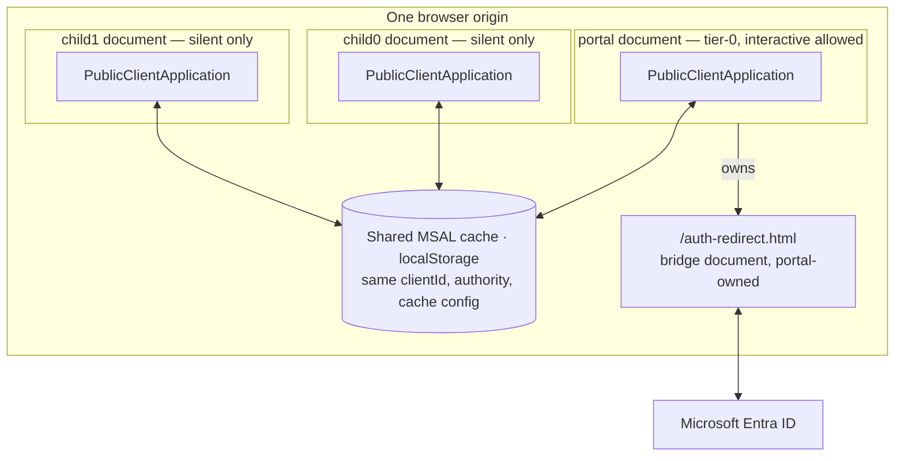
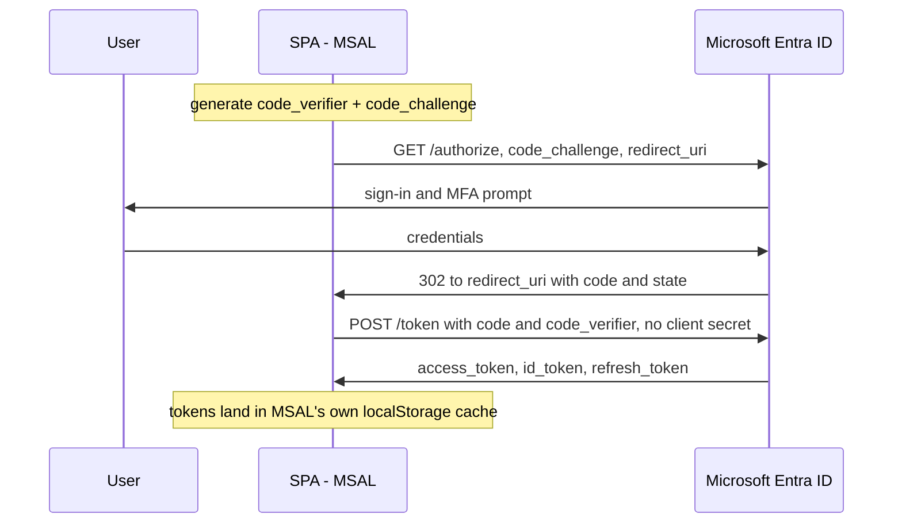
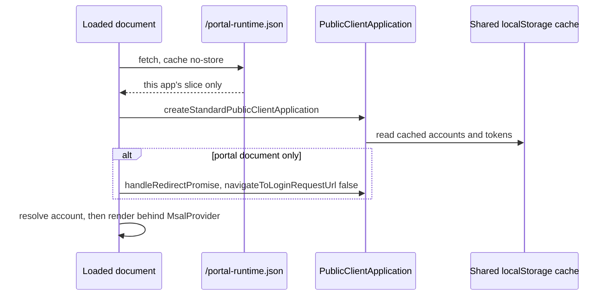
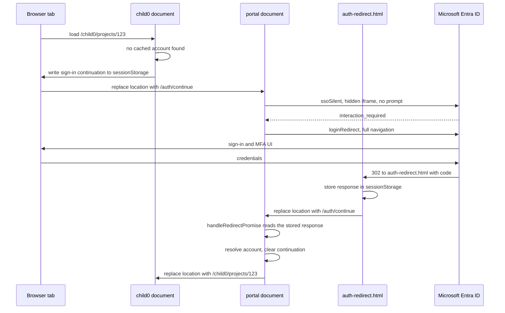
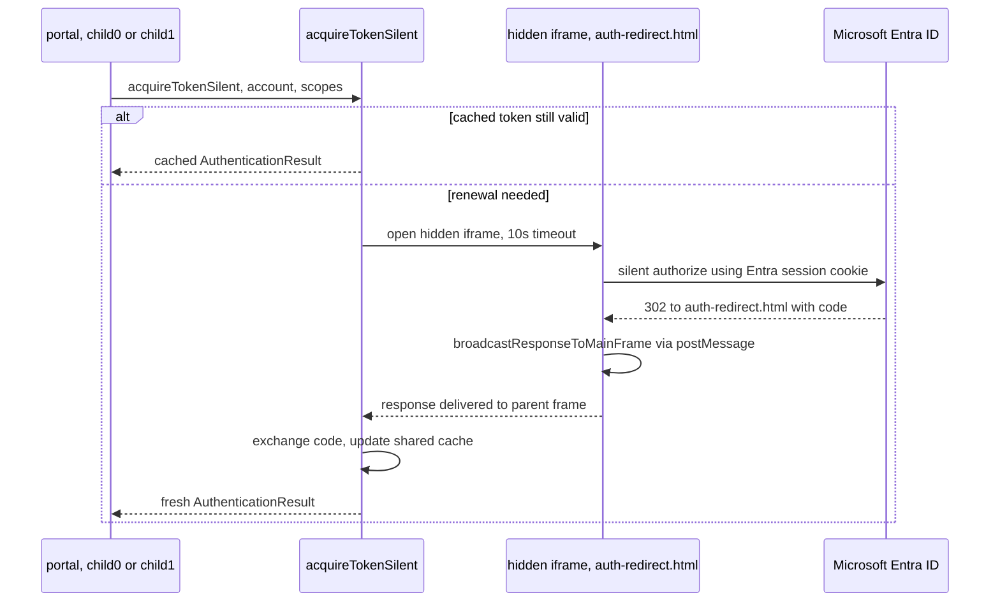
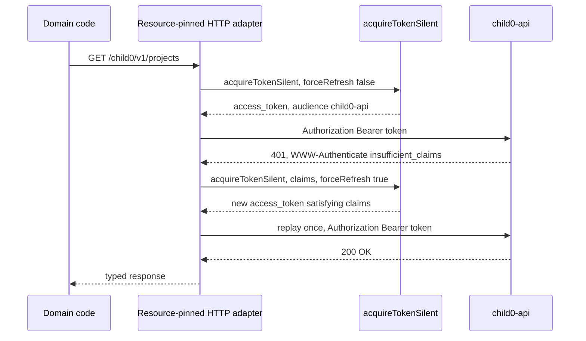
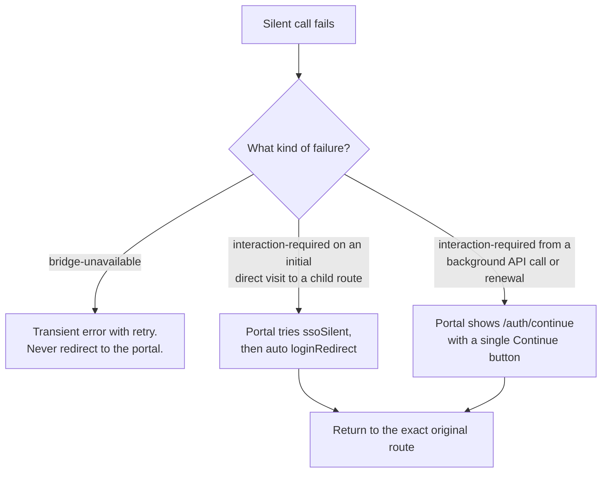
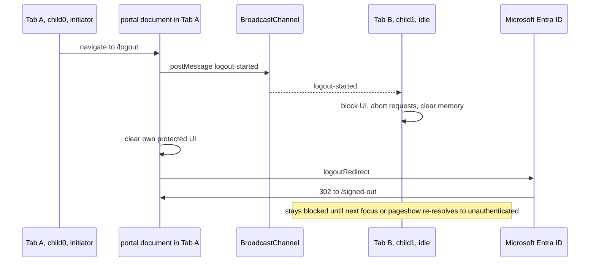

# Auth Flows & MSAL — how sign-in works across portal, child0, and child1

This is a diagrammed walkthrough of the authentication architecture recorded in
[`msal-app-shell-setup-pack/`](../msal-app-shell-setup-pack/README.md). It exists to teach the
*mechanism* — what actually crosses the network and the browser on each flow — rather than
restate the rules. The topic files in that folder remain the authoritative, decision-backed
source; this document is a companion, not a replacement, and introduces no new decisions.

If you only read one thing first, read this: **three separately built SPAs — `portal`,
`child0`, `child1` — run on one browser origin. Each loaded document creates its own MSAL
`PublicClientApplication`, and the only thing they share is the same-origin browser cache.**
Everything below is a consequence of that one fact.

---

## 1. The shape of the system

Three documents, three separate `PublicClientApplication` instances — never a shared global
instance, never tokens passed between apps directly. State only moves between them because
they happen to read and write the same `localStorage` keys, which is why origin, client ID,
authority, and `cache` config must be byte-identical across all three, sourced from one
`/portal-runtime.json` endpoint. Only the portal ever calls an interactive MSAL API
(`loginRedirect`, `ssoSilent`, `logoutRedirect`); child0 and child1 are silent-only and hand
off to the portal the moment silence isn't enough. `portal-web` being down stops sign-in,
renewal, recovery, and logout suite-wide — it is the suite's tier-0 dependency.

---

## 2. MSAL in 90 seconds

Underneath all the app-specific plumbing, MSAL is doing one standard thing: an OAuth 2.0
Authorization Code flow with PKCE, run entirely in the browser because a SPA is a *public*
client — it has no client secret to protect.

`code_verifier`/`code_challenge` (PKCE) stand in for a client secret: only the browser that
started the flow holds the verifier, so a stolen authorization code is useless to anyone else.
MSAL generates it, stores it, and does the code exchange for you — application code never
touches a code or a client secret.

---

## 3. Bootstrap — one instance per document

The instance is created **outside React's render path**, before anything renders — not inside
a component or an effect, and never a second time. Only the portal explicitly calls
`handleRedirectPromise`; children never do, though `MsalProvider`'s own internal call is
harmless there since there's never a redirect result to consume. Account resolution is
deterministic, never "first cached account": active-and-still-cached wins, then exactly-one
cached account, then `selection-required` if there's more than one, then `unauthenticated`.

---

## 4. Signing in — the redirect bridge

`/auth-redirect.html` is the one registered `redirectUri` for all three apps. It does exactly
one thing — call `broadcastResponseToMainFrame()` — with no router and no `MsalProvider`
(that's a hard requirement under MSAL Browser v5; a routed `/auth/callback` doesn't work).

Notice the child never talks to Entra directly. A direct deep link to `/child0/projects/123`
with no cached account is treated as *foreground sign-in intent*: the portal tries silent SSO
first, and only falls back to a visible `loginRedirect` if silence fails — no extra click.
The exact return path travels as a validated, short-lived (`≤10 min`) continuation record in
`sessionStorage`, never as a query string.

---

## 5. Staying signed in — silent renewal

The same bridge document is reused for a completely different mechanism when a token just
needs renewing: a **hidden iframe**, not a full navigation.

This is why **every** application — not just the portal — must configure the bridge as its
`redirectUri`: without it, a child can't silently renew at all. If the iframe doesn't come
back within 10 seconds, that's classified as `bridge-unavailable` — a transient, retryable
failure — and is deliberately **never** treated as `interaction-required`. Conflating the two
would send users through a portal redirect to "fix" a bridge that simply hasn't loaded yet,
which loops.

---

## 6. Calling an API — silent-first, claims-aware

Access tokens never leave the HTTP adapter — not into React state, not into logs, not into
application storage.

Each application has exactly one **resource-pinned** adapter: it injects a token only for its
own API's base path, so a config mistake can't quietly attach a `child0` token to a
`child1` request. The retry budget is exactly one replay, and it depends on what came back:

| Response | What the adapter does |
|---|---|
| `401` with a valid claims challenge | one silent renewal with that claims value, `forceRefresh: true`, replay once |
| `401` with no claims challenge | one silent renewal, `forceRefresh: true`, replay once |
| `403` | no retry — render the authorization denial |
| `429` | no retry — obey `Retry-After` |
| `5xx` / network | no retry unless the MSAL call itself failed transiently |

If the replay is *also* `401`, the adapter stops and hands off to portal recovery — it never
retries indefinitely.

---

## 7. When silent fails — interaction recovery

A silent failure inside a child **never** triggers interaction there. It always becomes a
navigation to the portal, and the portal decides what happens next based on *why* silence
failed:

The distinction is *foreground vs. background*: landing on a child route with no session at
all reads as sign-in intent, so the portal can automatically progress from `ssoSilent` to a
visible `loginRedirect`. A token that expired mid-session while the user is already working is
different — the portal asks for one explicit click before doing anything interactive, so a
background renewal never hijacks the screen unannounced.

---

## 8. Signing out — cross-tab logout

Only the tab that initiates logout talks to Entra. Every other open tab is told to invalidate
itself locally, with no identity data on the wire.

The `BroadcastChannel` message carries only an event name, a source tab ID, and a timestamp —
never a token, account ID, or name. Every other tab re-runs the same deterministic account
resolver once it's next visible; nobody infers the new state from the message itself.

---

## 9. The token boundary — what's actually protecting you

Because all three apps share one Entra client ID and one browser cache, **the frontend token
boundary between them is soft by design**, and it's worth being precise about what closes it
and what doesn't:

- Backend audience validation (each API checking the token's `aud`) turns an *accidental*
  cross-resource request — a bug — into a clean `401`. That's real, and it's the backstop for
  mistakes.
- It does **not** stop *hostile* same-origin code. If script is executing on the origin at
  all, it can ask the shared MSAL instance for a `child1-api` token and receive one with the
  correct audience, scope, and subject — every backend check in this design accepts it,
  because it's a legitimate token.

The controls for that second case aren't in the token layer at all: an enforcing CSP with no
`unsafe-inline`/`unsafe-eval`/wildcards, no unreviewed third-party runtime script, exact
dependency/lockfile review pinned to one physical MSAL resolution, same-origin script
discipline, and prompt patching. This is why the pack treats a Content-Security-Policy
regression as a security incident on the same order as a broken auth check, not a
nice-to-have.

---

## Cheat sheet

| Rule | Why |
|---|---|
| One `PublicClientApplication` per loaded document, created outside render | avoids races before token APIs and route loaders run |
| Origin, client ID, authority, `cache` config identical across all three apps | this is the *only* channel state is shared through |
| Only the portal calls interactive MSAL APIs | children stay silent-only, so surprise redirects never hijack a child screen |
| `/auth-redirect.html` is a bare document, no router, no COOP header | v5 requires it; COOP severs the channel the bridge relies on |
| Tokens never leave the HTTP adapter | not into React state, Redux, storage, logs, or telemetry |
| One resource-pinned adapter per app | a config mistake can't attach the wrong token to the wrong API |
| At most one retry replay per request | prevents infinite retry loops and duplicate domain work |
| `bridge-unavailable` ≠ `interaction-required` | a broken bridge must never cause a redirect loop |
| Logout is single-initiator; other tabs just invalidate locally | avoids redirect races and duplicate server logout calls |
| Backend audience checks stop accidents, not hostile same-origin code | CSP and supply-chain discipline are the real controls for that |

## Where to go deeper

Each section above compresses one or more of the twenty settled topic files in
[`msal-app-shell-setup-pack/`](../msal-app-shell-setup-pack/README.md). For the full rule set,
the rejected alternatives, and the accepted open risks, read (in order):

`topology` → `msal-instance-and-bootstrap` → `redirect-bridge` → `account-resolution` →
`token-acquisition` → `authorized-http` → `interaction-recovery` → `cross-tab-and-logout` →
`authorization-layers` → `cae-and-claims-challenge`.
